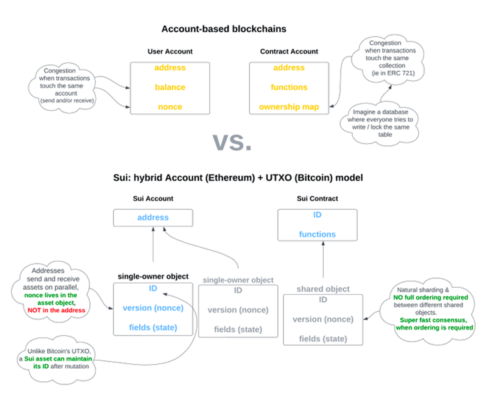

What is Sui?

smart contract platform that combines a novel object-centric data model with a purpose-built smart contract programming language - Sui Move.

Similar to how object-oriented programming allows for more unique data structures and interactions than functional programming, Sui’s object-oriented data model creates a unique developer environment for application builders. This model also creates a highly scalable system architecture allowing for parallel transaction processing and for certain transaction types to circumvent the consensus process.

Another novel feature of the Sui platform is the Sui Move programming model, which differs from the conventional Move language in ways that allow for unique global storage and object interactions. Sui Move retains all the powerful security and usability features that are found in the core Move language.

## Object central Data Model
 The majority of smart contract platforms (e.g. Ethereum, Solana, and Aptos) use an account model to track blockchain state where others (e.g. Cardano) use unspent transaction outputs (UTXOs).

 Sui’s object-centric data model is akin to a hybrid of the two more traditional distributed ledger state paradigms. Sui objects (e.g token balances, NFTs, smart contracts, etc.) can be owned by user accounts but are distinct and not included in or a part of an account.

 Each object has its own globally unique object ID and a version number allows the network to keep track of the object over time. When a transaction modifies an object, it writes the new contents on-chain to the same object ID but with an incremented version value. The most recent version of an object is considered ‘Live’ and is able to be used as an input for another transaction. Within an object’s metadata, an owner is defined. The type of owner an object has dictates how the object can be interacted with.

 
https://twitter.com/kostascrypto/status/1634254008738267137

By separating accounts from objects, Sui avoids congestion typically observed when a user submits multiple transactions. If a user interacts with separate, unrelated objects the execution paths of each transaction diverge, allowing for parallel execution and creating a horizontally scaled environment.

## Object Ownership in sui
As mentioned in the previous slide, there are four types of object ownership in Sui:

Owned by an address

Owned by an object

Shared

Immutable

Objects owned by an address are likely the most familiar concept and are the most common ownership type. An example would be a fungible or non-fungible token owned by a user address. An object of this type can only be used in transactions that are signed by the owner’s address.

An object owned by another object is similar to the concept of object wrapping in traditional object-oriented programming but has significant differences in usability. For example, transactions involving objects containing multiple wrapped objects require a higher gas price than those without any wrapped objects. In contrast, transactions involving objects that own other objects do not have the same high gas demands as those with objects wrapped inside.

Shared objects allow for anyone to read or write to the object. Most smart contract applications will be surfaced through shared objects, allowing users to interact with them. Since multiple users can interact with shared objects at any point in time, transactions involving shared objects must be sequenced by validators.

Immutable objects do not have a defined owner, are accessible by any user, and cannot be changed.

## Sui transaction lifecycle
The lifecycle of a transaction in Sui is dependent on whether or not the transaction interacts with a shared object.
Since ownership of objects in Sui is clearly defined in the object’s metadata, in the case of non-shared objects, network validators do not have to come to consensus on whether or not a user can interact with an object. This allows for a streamlined transaction finalization process for transactions involving non-shared objects (i.e. single-writer transactions).

The lifecycle for such transactions is as follows:
User broadcasts transaction to Sui Validators

Validators vote on the validity of the transaction

The user collects validator votes, creates a certificate once a Byzantine-resistant majority of votes are received, and broadcasts the certificate to the validators.

Validators respond a final time ensuring finality of the transaction

Since single-writer transactions do not require strict ordering within Sui, they do not need to be sequenced and agreed upon through consensus, creating a much shorter time to finality and allowing them to be executed in parallel.

When a transaction interacts with a shared object, strict ordering and consensus are required. This adds an additional step to the process of finalizing the transaction. Once the user creates and broadcasts a certificate, validators sequence the transaction using Narwhal and achieve consensus on the transaction using the Bullshark consensus algorithm. Once consensus is reached, then the transaction is considered finalized.

## Move and Sui Move
In Solidity, the concept of using digital assets other than the network’s native asset was not included in its development. Thus, the creation of token standards (e.g. ERC-20) was introduced later. The Move programming language was purpose-built for blockchain application development with a focus on the programming of digital assets and safety guarantees.

thus can learning move help und blockchain better ?
The Move virtual machine (MoveVM) requires Move code to be compiled and passed through the Move bytecode verifier (guaranteeing that the code adheres to its safety rules). Also, it provides a dedicated formal verification tool, the Move Prover. This abstracts away the difficulty in writing safety rules for application developers and provides certainty that applications will adhere to all logic defined in the application.

Some of the biggest exploits in the space have occurred from loopholes in code such as account substitution and re-entrancy. Move’s security features will not allow such exploits to be available in applications.

The original implementation of Move is fitting for account-based storage models, but since Sui has an object-based storage model, an adapted version called Sui Move has been developed. By reworking Move to fit Sui’s object-oriented model, it allows for some unique possibilities, such as native asset storage, simple mass asset creation, and the ability to bundle heterogeneous assets together.

## unique possibilites in sui
The ability to fast-track single-writer transactions can be leveraged to build applications that favor such transactions achieving extremely fast finality.

Sui provides a unique opportunity for developers to creatively use single-writer transactions to drastically reduce application latency. Some examples include:

Private or Public messaging - social networks and private decentralized repositories

Posting oracle data

Mass minting of game assets

… and many more

Sui has a powerful data storage model that we haven’t covered in this Mini-Course that allows for low cost of storage, creating a great environment to build gaming applications.

