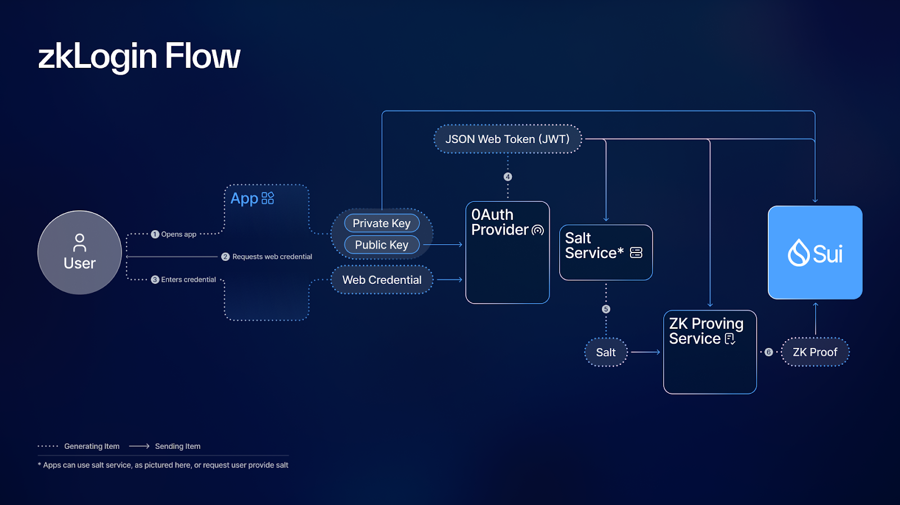

zkLogin reduces onboarding friction by allowing users to log into apps with existing web credentials.

Web3’s Onboarding Problem

An application’s growth depends on the ability for people to quickly and seamlessly sign up.

Onboarding new users to blockchain apps is a difficult task made more difficult by the inherent friction of current blockchain wallet experiences. 

When potential users hear about an exciting new game or application on a blockchain, trying it out typically involves a much more complicated process than they’re used to. The application asks them to connect a wallet which forces a new user to select a wallet, install it, then go through the unfamiliar steps of creating an account using seed phrases. Many users will just give up resulting in significant onboarding drop off.

App developers attempting to ease wallet onboarding friction are limited to either: (1) developing and managing custodial wallets, which requires additional engineering and regulatory overhead, or (2) integrating a third-party authentication solution, which introduces an extra layer of dependency and trust in out-of-protocol hardware or services. While both options remove key friction points (software and seed phrase management), they have significant downsides.

### Creating a Seamless Wallet Onboarding Experience
A few third-party services have been created to allow onboarding with common web credentials via OpenID authentication. While these solutions provide a familiar login sequence to users, they require the user to trust third-party hardware/services and smart contracts which has potential for issues around accessibility and even privacy.

A login experience based on web credentials naturally caters to those newer to blockchain or more familiar with current internet practice. But it is important that the ethos and ideals of permissionless and trustless blockchain structures should not be compromised. An ideal solution would be a cryptographic primitive enshrined in the protocol allowing for builders to integrate typical OpenID authentication for wallet creation and management. 

Sui’s zkLogin is exactly that. As a primitive, zkLogin leverages zero-knowledge cryptography native to Sui to offer people the ability to login with web credentials while still maintaining privacy.

## ZkLogin
zkLogin lets users securely create accounts and submit transactions with their web login credentials, providing significant convenience for end-users without compromising security. It uses temporary keypairs and zero-knowledge cryptography to connect an OAuth provider’s response to a specific Sui account. zkLogin is enshrined at the protocol level, meaning there are no outside dependencies apart from the OAuth provider.
So, how does it work?

With zkLogin a unique Sui address is created for each OAuth credential + app combination. 
A single OAuth credential can be used to manage independent addresses associated with an unlimited number of apps. 
For example, a single Google account connected to two different decentralized exchange apps will have two distinct Sui addresses—one for each app.

For a typical blockchain address, a persistent public-private key pair is associated with the address at the time of creation and the address identifier is derived from the public key. With zkLogin, addresses are associated with temporary key pairs which must be regenerated regularly through an OAuth login flow. By design, Sui addresses are able to remain fixed while the associated key pair can be changed. This is possible because zkLogin addresses are derived from a unique identifier obtained from the OAuth provider's returned payload called the “key claim”, rather than a public key.

### zklogin mechanics
The process for zkLogin is six sequential steps:

Step 1: Generate ephemeral keys

When a user opens the app, it generates a temporary, or ephemeral, keypair for the user. This keypair is given an expiration period which determines the frequency of required log-ins.

Step 2: Generate a JSON Web Token (JWT)

The app prompts the user to authenticate themselves through an OAuth provider sign-in, yielding a JSON Web Token (JWT)—a digitally signed data payload from the provider. This JWT incorporates a nonce field, which, in the context of zkLogin, encompasses the public key alongside an expiration period. Embedded in the JWT is the key claim which is used to generate the Sui address later.

Step 3: Request the user’s unique salt

The salt is an arbitrary string of numbers that is used in combination with the JWT and ephemeral keypair to associate the OAuth credentials with the Sui address. The path taken in this step is app dependent as there are different design options for builders. The zkLogin docs outline multiple options for salt management, each with their own tradeoffs.

One approach is an SSO-style salt management option that employs a salt service to store and provide the salt as needed. With this path, the app sends the JWT token to a salt service which returns the unique user salt upon validation of the JWT token. Another approach to salt management requires the user to set their salt when they log in for the first time and to manage it themselves, treating it as a password or pin.

Step 4: Generate a zk proof

Armed with the JWT token, salt, and public key, the process proceeds to request a zero-knowledge (zk) proof from a zk proving service. This crucial step rigorously scrutinizes the accuracy of the request by ensuring: 1) the nonce is defined correctly and includes the public key, 2) the key claim provided is consistent with the JWT, 3) the address is consistent with the key claim and user salt, and 4) the OAuth providers signature is correct. If any element fails to conform to expectations, the whole step will fail.

Step 5: Identify the user Sui address and construct transaction

The application then identifies the user’s Sui address based on the user salt and key claim extracted from the JWT. A transaction is endorsed using the private key bundled with the ephemeral signature, zk proof, and supplementary inputs from the JWT before being forwarded to Sui. 

Step 6: Validate transaction

Once on the blockchain, Sui validators meticulously scrutinize both the zk proof and the ephemeral signature for authentication. In the blink of an eye, the transaction is officially logged in Sui, seamlessly concluding the process.

## How sui enables zklogin
Sui’s cryptographic agility and object-oriented design enables a seamless OAuth login integration through zkLogin. Unlike most blockchains that inherently support only one cryptographic authentication method, Sui distinguishes itself by allowing the integration of various cryptographic schemes directly. This ability eliminates the need for users to incur additional gas costs for transaction execution using out-of-protocol cryptography. With Sui, the introduction of new native cryptographic authentication methods maintains compatibility with existing systems, ensuring users aren't disadvantaged for opting to use different cryptographic approaches.

Conventional Web3 OAuth login solutions rely on smart contracts for JSON web keys (JWKs) validation, necessitating trust in the accuracy of oracle data posting. Sui revolutionizes this process by representing JWKs as Sui objects, consolidating validation. With zkLogin, Sui validators take on the role of oracles, ensuring adherence to the predefined rules for JWK verification. This streamlined approach enhances security and reliability in the authentication process

Most Web3 solutions with user-friendly onboarding come from custodial providers. These providers manage the private key for the user and offer familiar recovery paths should a user forget their password. While this solution works for the enterprises willing to satisfy the regulatory obligations required to custody assets, many builders don’t have the time and budget to undergo that process.

zkLogin’s self-custody path reduces the regulatory burden and reduces the time to market for adding simple sign-on. The decision that each builder must make is how comfortable their target audience is with self-custody, and if zkLogin is right for all, some, or any of their users. This understanding helps determine what other account creation and key management systems a builder may want to incorporate alongside zkLogin, if any.

Being a Sui primitive, zkLogin is compatible with other Sui primitives such as sponsored transactions. The design space for the onboarding experience is vast allowing builders to create unique experiences with Sui’s technology.