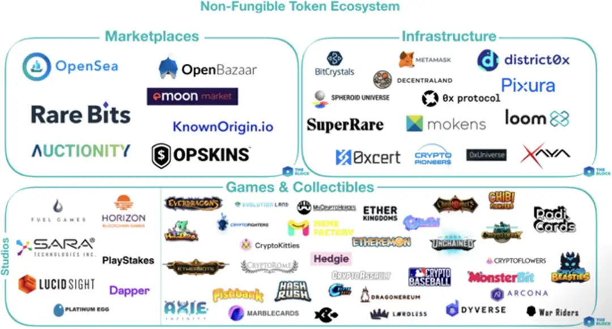
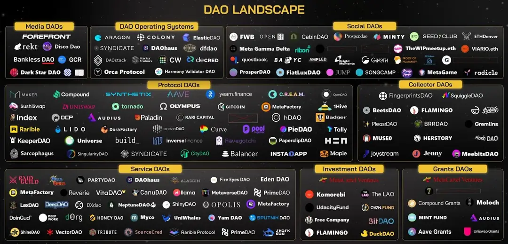
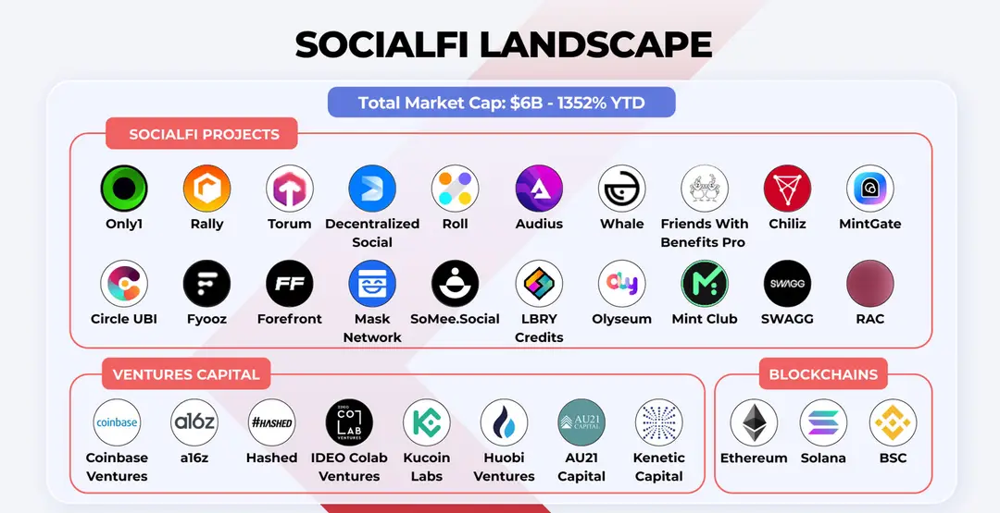

Web3 is aiming to build a decentralized, user-led network for the next generation of the internet. In this vibrant domain, there’s a wide range of tracks covering key areas such as Decentralized Finance (DeFi), Non-Fungible Tokens (NFTs), Decentralized Autonomous Organizations (DAOs), Decentralized Identity (DID), Social Finance (SocialFi), Game Finance (GameFi), and Infrastructure. Each track has given birth to innovative and influential classic projects, from DeFi protocols that provide financial autonomy users, to NFT marketplaces that grant unique identities to digital creations, to platforms that facilitate group decision-making through DAOs. Each track is a pivotal component of the Web3 world, together constructing a more open, transparent, and inclusive digital future.

Decentralized Finance
Decentralized Finance (DeFi) refers to financial services and applications based on blockchain and smart contract technology, allowing users to engage in financial transactions directly through smart contracts. Unlike traditional centralized finance (CeFi), DeFi operates without central authorities or intermediaries. Within the DeFi ecosystem, banks, brokers, and other intermediaries from the traditional financial world are replaced by smart contracts, which run autonomously via code and are open and transparent, enabling anyone to participate and verify.DeFi offers seamless access to financial services globally, including many innovative financial products and services. Typical DeFi projects include Uniswap (a Decentralized Exchange), Aave (a decentralized lending platform), and MakerDAO (the decentralized stablecoin DAI creator). These projects are driving the financial industry towards a direction that is more open, transparent, and inclusive. DeFi also ensures the immutability of financial transaction records through distributed ledger technology, thereby enhancing the security of the financial system.

Non-Fungible Tokens
Non-Fungible Tokens (NFTs) are a special type of cryptographic asset built on blockchain technology, secured by smart contracts to ensure their uniqueness and scarcity. Unlike traditional cryptocurrencies like Bitcoin or Ethereum, each NFT has a unique identifier. Every NFT is like an art piece or collectible with a unique number, such as a painting or a limited edition stamp, and cannot be simply exchanged due to their different values and characteristics.NFTs offer an immutable proof of uniqueness and ownership, providing a monetization method for digital content creators. Classic NFT projects include digital art platforms like OpenSea andarible, where creators can sell their works directly to collectors. Moreover, NFTs can be used in gaming, such as in CryptoKitties, where each kitty is a unique NFT that players can buy, breed, and trade within the game. As NFT technology matures and gains market recognition, it is gradually expanding into more fields, such as music, film, and sports.

Decentralized Autonomous Organizations
Decentralized Autonomous Organizations (DAOs) represent an innovative organizational form based on blockchain technology, differing from traditional centralized management structures. In DAOs, power and decision-making processes are decentralized. For significant issues like fund allocation, rule setting, and project development directions, decisions aren’t made by a single leader or small group, but rather by members who hold organization tokens and make collective voting decisions. DAOs automate rule enforcement through smart contracts written into code, ensuring determinacy and transparency.DAOs allow members to make decisions collectively without a central manager, promoting a fairer and more transparent decision-making process and enhancing collaboration among community members. Classic DAO include MolochDAO, an organization focused on funding the Ethereum ecosystem. Its operation involves members submitting proposals for funding, which are then voted on by other members to decide approval. If a proposal gains enough votes, funds are disbursed from the DAO’s treasury to execute it. All proposal information is public, allowing anyone to view project descriptions, votes, and execution status, increasing transparency and community involvement.

Social Finance
Social Finance (SocialFi) combines the characteristics of social networks with decentralized finance (DeFi) by utilizing blockchain technology to enable asset creation, exchange, and value appreciation while engaging in social interactions. Unlike traditional social platforms, SocialFi platforms reward users with tangible economic incentives, such as tokens or NFTs, for participating in social activities like posting, commenting, and sharing content, while ensuring they retain ownership and control over their data. This model disrupts the traditional profit-sharing mechanism of social networks, redirecting value back to content creators and community members.Social Finance redefines the reward system for content creation and community participation, allowing users not only enjoy social interaction but also to earn tangible benefits. Mirror is one of the mainstream SocialFi projects, where creators can ensure their digital copyright and distribute earnings through cryptocurrency on the platform. For instance, after publishing an article, a creator can receive token rewards based on the article’s popularity and user engagement (likes, shares, comments, etc.). Creators can also conduct crowdfunding campaigns on the platform, creating tokenized crowdfunding projects smart contracts. These tokens may appreciate as the creator’s success grows, attracting investors to support their work.

ame Finance
Game Finance (GameFi) is a gaming model that integrates cryptocurrencies and Non-Fungible Tokens (NFTs), allowing players to participate in virtual game worlds and earn real economic rewards. This gaming model players ownership and trading capabilities of assets, enabling them to freely buy, sell, exchange, or invest in those assets. GameFi projects often incorporate DeFi functionalities such as liquidity mining, lending, and yield farming, allowing to engage in complex financial activities while enjoying gaming.Game Finance creates a new economic model where players’ time and skills can be converted into real-world wealth, fostering the circulation and innovation of digital assets. Axie Infinity, a classic GameFi project, allows users to buy, breed, nurture, and trade virtual pets. Pets with rare attributes often have higher market value, and users can profit by breeding and selling these pets. Additionally, participating in battles can earn users SLP and AXS tokens, which can be exchanged for real currency in the cryptocurrency market. By staking AXS and SLP tokens in DeFi protocols, users also have the opportunity to gain additional earnings.
 Decentralized Identity
Decentralized Identity (DID) is an identity verification method based on blockchain technology that allows users to own control their identity information without relying on any centralized organization or service provider. In this system, user identity data is encrypted and distributed across the blockchain network. can manage their identity proofs and related data autonomously, using private keys for secure verification, thus ensuring the reliability and privacy of identity information.ID provides sovereignty over identity data and privacy protection for users. A typical DID project example is ENS (Ethereum Name Service), which allows users convert complex Ethereum wallet addresses into readable and memorable domain names, such as “alice.eth,” simplifying the transaction process and improving user experience., these domain names serve as identifiers in the Web3 world, making it easier for users to manage and showcase their decentralized identities.
 Infrastructure Track
The infrastructure track provides essential underlying technological support for the operation of the entire Web3 ecosystem, much like a solid foundation is required for a building. It includes a range of key technology components as blockchain protocols, smart contract platforms, node networks, distributed storage, and cross-chain interoperability protocols, ensuring the safe and efficient running of all applications and services.The infrastructure track lays a sturdy foundation for the Web3 ecosystem, enabling developers to build more complex and feature-rich decentralized applications. There are many notable infrastructure projects; for instance, Ethereum provides a smart contract platform for developers to create various decentralized applications; IPFS (InterPlanetary File System) is a distributed storage network addressing data storage and transfer issues; Polkadot and Cosmos aim to solve interoperability issues between blockchains, allowing blockchain networks to transfer information and value. These infrastructure projects are the cornerstone of Web3 ecosystem development, playing a crucial role in advancing innovation and maturity the industry.

